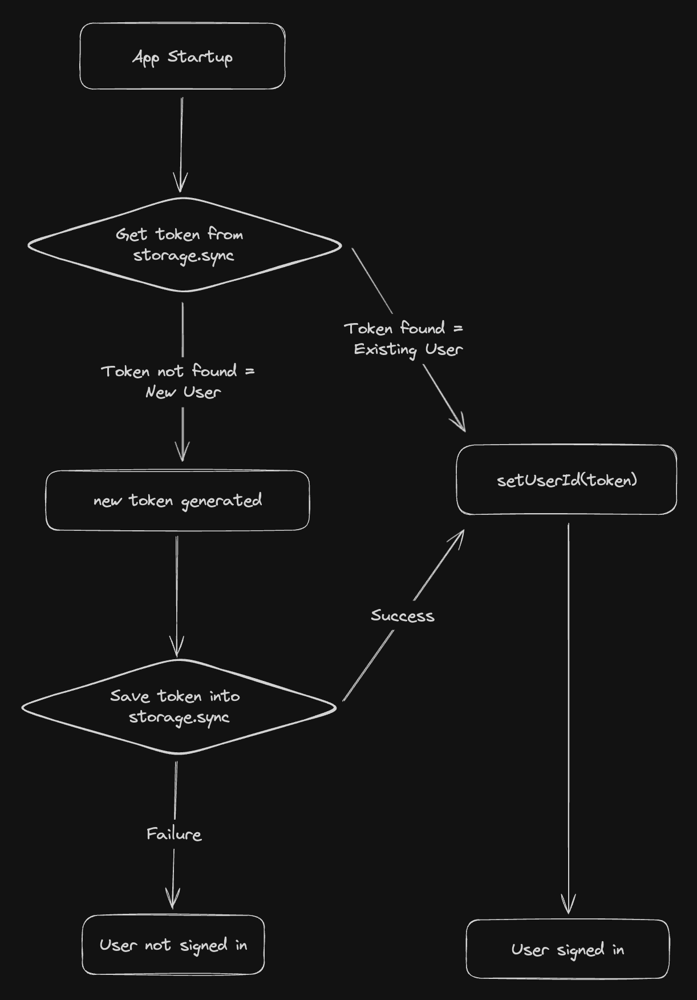

## Introduction

[Tab Keeper](https://chromewebstore.google.com/detail/tab-keeper-chrome-tab-man/gpibgniomobngodpnikhheifblbpbbah?ref=portfolio) is an open-source[^1] Chrome extension project I initiated, designed for efficient tab management and cross-device synchronization. In this post, I will explain in detail the technical aspects of implementing Tab Keeper's anonymous login mechanism, leveraging the `chrome.storage`[^2] API.

## Rationale Behind the Shift

It's amazing how a single comment can shift your perspective. That's what happened with Tab Keeper. After seeing a Reddit discussion pointing out the unnecessary hassle of the login process, it clicked: why not make things simpler? So, I decided to integrate the `chrome.storage` API for an anonymous login experience. The goal was to streamline the data synchronization across devices, emphasizing security and privacy without the cumbersome login steps. Long gone are the days when users had to sign up with their private email addresses just to enjoy seamless cross-device data synchronization.

## How It Works

The mechanism is straightforward:

- **For Returning User**: If a UUID is found in the user's `storage.sync`, it's used to pull data from Firebase Cloud Firestore.
- **For New User**: Absence of a UUID triggers the generation and storage of a new one in `storage.sync`.

## Technical Overview

The system is designed to work optimally when users have Chrome sync enabled. If Chrome sync is not enabled, the extension uses a fallback strategy using `storage.local`, almost[^3] resembling `localStorage`, ensuring data persistence locally without synchronization.

## Why Firebase Cloud Firestore?

Despite the efficient data syncing capabilities of the `chrome.storage` API, it has storage limitations (100KB in total, 8KB per item)[^4]. Therefore, Firebase Cloud Firestore is used for its scalability and flexibility, with the UUID serving as a unique reference to the user's data.

## Future Considerations

Based on user feedback, I'm exploring the idea of adding an optional login module (something like Clerk) in the future so that users can access their data across devices without relying on Chrome sync.

## Impact on User Experience

The shift to anonymous login has been a game-changer for Tab Keeper. This feature has not only streamlined the user experience, making the extension more efficient and secure, but it has also been instrumental in its growth to over 350 monthly active users worldwide. This increase in users is a testament to the appeal of hassle-free and seamless cross-device synchronization without the need for a cumbersome login process. As Tab Keeper continues to evolve, I remain committed to this journey of innovation, always with an ear to the ground for your invaluable feedback and suggestions.

[^1]: [Tab Keeper GitHub Repository](https://github.com/justine-george/tab-keeper-react-chrome-extension)
[^2]: [API reference for `chrome.storage`](https://developer.chrome.com/docs/extensions/reference/api/storage)
[^3]: [Details of various Chrome storage areas](https://developer.chrome.com/docs/extensions/reference/api/storage#storage_areas)
[^4]: [Storage limits of `storage.sync`](https://developer.chrome.com/docs/extensions/reference/api/storage#storage_areas)
