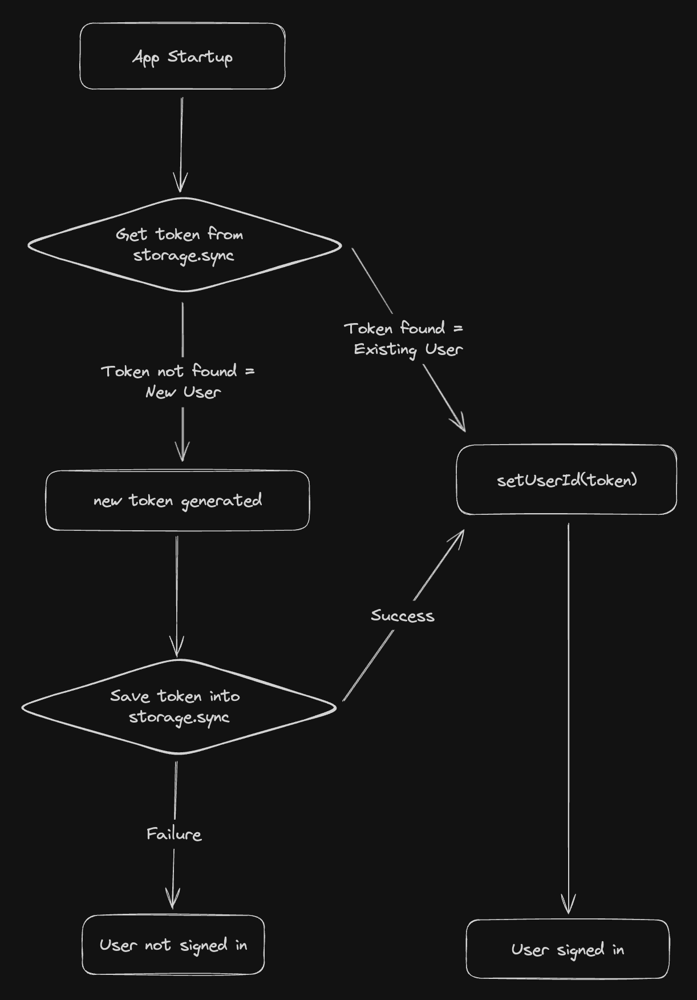

[Tab Keeper](https://chromewebstore.google.com/detail/tab-keeper-chrome-tab-man/gpibgniomobngodpnikhheifblbpbbah?ref=portfolio) is an [open-source](https://github.com/justine-george/tab-keeper-react-chrome-extension) Chrome extension project, designed for efficient tab management and cross-device synchronization. In this post, I will explain in detail the technical aspects of implementing Tab Keeper's anonymous login mechanism, leveraging the [`chrome.storage` API](https://developer.chrome.com/docs/extensions/reference/api/storage).

## Rationale Behind the Shift

The idea to shift gears came from an unexpected place. A conversation on Reddit made me realize the potential hurdle of mandatory sign-up processes. It struck me: why not simplify access? That led to the adoption of the `chrome.storage` API for a smoother, anonymous login process. My aim was to make syncing data across devices as straightforward and secure as possible, removing the need for users to provide personal information just to use our syncing feature. Now, users can enjoy effortless cross-device synchronization without the hassle of traditional sign-up procedures.

## Technical Overview

The process is simple:

- **For Returning User**: A version 4 UUID token in `storage.sync` serves as the document key to retrieve data from Firebase Cloud Firestore.
- **For New User**: In the absence of a UUID, a new RFC version 4 (random) UUID token is generated and stored in `storage.sync`.


_Figure 1_

Here's a simplified version of the implementation shown in Figure 1. The `getUserTokenFromChromeStorageSync` function is called when the component mounts, ensuring that the user's token is retrieved from `storage.sync` and used to access their data in Cloud Firestore. Here's the code snippet:

```jsx
useEffect(() => {
	getUserTokenFromChromeStorageSync();
}, []);

function getUserTokenFromChromeStorageSync() {
	chrome.storage.sync.get(["tokenValue"]).then((result) => {
		let { tokenValue: token } = result;

		if (!token) {
			token = uuidv4();
			chrome.storage.sync
				.set({ tokenValue: token })
				.then(() => {
					dispatch(setSignedIn());
					dispatch(setUserId(token));
				})
				.catch(() => {
					dispatch(setLoggedOut());
					dispatch(removeUserId());
				});
		} else {
			dispatch(setSignedIn());
			dispatch(setUserId(token));
		}
	});
}
```

The system is designed to work optimally when users have Chrome sync enabled. If Chrome sync is not enabled, the extension uses a fallback strategy using `storage.local`, [almost](https://developer.chrome.com/docs/extensions/reference/api/storage#storage_areas) resembling `localStorage`, ensuring data persistence locally without synchronization.

## Why Firebase Cloud Firestore?

While the `chrome.storage` API is great for data syncing, it has its limitations—specifically, [a cap of 100KB total storage and just 8KB per item](https://developer.chrome.com/docs/extensions/reference/api/storage#storage_areas). Cloud Firestore was the right choice not just for its ability to scale and handle larger datasets, but also because its [free tier](https://firebase.google.com/pricing) helps manage user data efficiently without incurring costs. Using a UUID to track each user's data also made it simple to keep everyone's information secure and easily accessible, ensuring that the solution was both practical and cost-effective.

## Future Considerations

In response to some great feedback, I'm thinking about making Tab Keeper even better. One idea I'm excited about is adding a login feature, using a third-party service like [Clerk](https://clerk.com/). This would allow us to access our data across various devices, moving beyond the limitations of Chrome sync. This would not only make things more convenient but also add a personal touch, like being able to share tabs with our loved ones. For the moment, the anonymous login is working great, and I'm eager to see how it evolves.

## Impact on User Experience

Switching to anonymous login for Tab Keeper has truly transformed its usability. It's made the extension smoother and more secure, which is a big reason why we've seen our community grow to [**over 350 weekly active users**](https://chromewebstore.google.com/detail/tab-keeper-chrome-tab-man/gpibgniomobngodpnikhheifblbpbbah?ref=portfolio) worldwide, at the time of writing this post. This increase in users is a testament to the appeal of hassle-free and seamless cross-device synchronization without the need for a cumbersome login process. As Tab Keeper continues to evolve, I remain committed to this journey of innovation, always with an ear to the ground for your invaluable feedback and suggestions.
