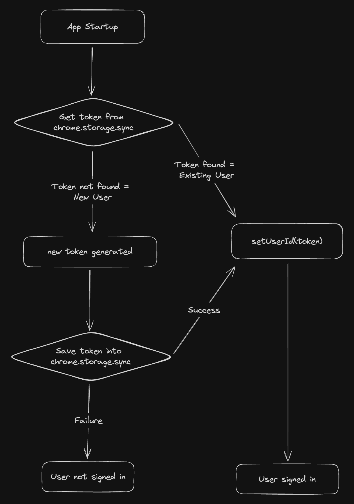

In the initial version of the app, users were required to register and log in to sync their data across devices. While this method was effective, it presented an extra step that could potentially hinder the smooth user experience we aimed to provide. Thus, to mitigate this friction, we transitioned to an anonymous login mechanism using `chrome.storage.sync`. This API, akin to `localStorage`, syncs data across devices as long as Chrome sync is enabled. This shift eradicated the need for manual user registration, simplifying the user’s first interaction with our app considerably.

Upon the first launch of the app, a check is performed to see if a unique identifier (UUID) exists in the user's chrome.storage.sync:

- **Returning User**: If the UUID exists, it's utilized to retrieve the user’s data from our Firebase Cloud Firestore database.
- **New User**: In the absence of a UUID, a new identifier is generated, assigned, and saved in `chrome.storage.sync`.

The underlying assumption here is that users are already logged into their browsers with sync enabled. This is a reasonable presumption given the widespread use of browser sync features. In scenarios where sync is not enabled, the mechanism defaults to behaving like `localStorage`, ensuring that nothing breaks and the user experience remains seamless.

We continue to leverage Firebase Cloud Firestore for data storage, given the tight storage restrictions imposed by `chrome.storage.sync` (100KB total, 8KB per item). The only piece of data synced across the user’s devices is the UUID, which acts as a key to access their data in our database.

Following suggestions, we recognize the potential benefits of introducing a separate login module, which would provide an additional layer of user identification. This feature is something we are keen on exploring and have earmarked for our future development roadmap.

By adapting our app to utilize anonymous login through `chrome.storage.sync`, we have significantly streamlined the user onboarding process, making the user's journey from installation to usage swift and hassle-free. This change, among others, underscores our continuous efforts to enhance user satisfaction and engagement, as we progressively refine our app to meet and exceed user expectations.
